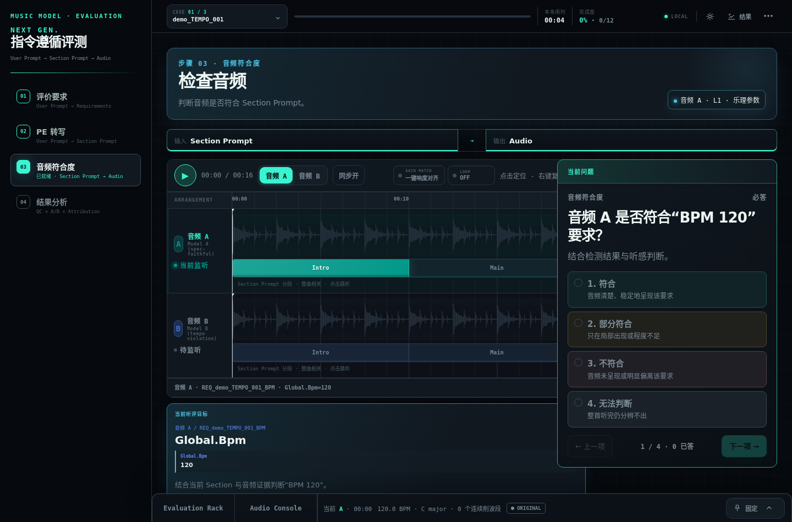
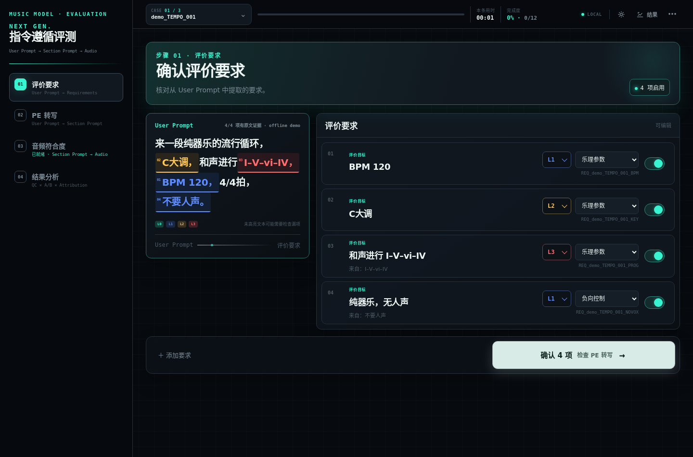

# musicgen-if-eval

**Instruction-following evaluation workbench for text-to-music models.**

Two artifacts, one methodology:

| File | What it is |
|---|---|
| **[`index.html` — full workbench](https://hycccc.github.io/musicgen-if-eval/)** | A sanitized 1:1 replica of the production evaluation workbench I built and run at work. Full four-step pipeline, synced A/B player, evidence engines. ~25MB, fully self-contained. Opens with a 60-second guided tour on first visit (replayable from the topbar). |
| **[`lite.html` — lite version](https://hycccc.github.io/musicgen-if-eval/lite.html)** | A minimal single-file distillation of the same methodology, built from scratch. |

## What the full workbench does

Text-to-music prompts bundle many constraints — key, tempo, harmony, structure, vocals, negative controls. The workbench decomposes evaluation into a four-step flow:

1. **Requirement confirmation** — the user prompt is decomposed into per-dimension requirements (14 dimension types, L0–L3 difficulty tiers), with evidence spans highlighted inline in the original prompt:

   
2. **PE transcription check** — before judging audio, judge the *prompt engineering*: did the system's section-prompt rewrite honor the user's instructions? Attribution matters — a failure caused by a bad rewrite is not a model failure. (Demo case 3 plants a deliberate rewrite conflict.)
3. **Audio compliance** — a synchronized A/B player with waveform lanes, section arrangement overlays, gain matching and looping; per-requirement verdicts anchored by evidence modules: structured captions, instrument-activity transcription, loudness (BS.1770-style), spectral diagnostics, blind reverb heuristics, and offline MIR estimates — every automated signal labeled with its authority level ("guardrail, not gold").
4. **Results & attribution** — QC summary, A/B comparison, and failure attribution, exportable for the eval pipeline.

Plus a **pitch lab**: a playable reference piano (Salamander Grand Piano samples) with roman-numeral theory helpers for verifying keys and progressions by ear.

## Provenance & sanitization

This is a real production tool, published via a data-substitution pipeline:

- **All application code is preserved** except one clause: the case loader hard-required LLM provenance from a specific model; demo cases are hand-authored, so that single check was removed.
- **All original data is replaced.** The three demo cases are synthesized from musical specs (key / mode / roman-numeral progression / BPM), so ground truth is known by construction: side A honors the prompt, side B plants exactly one violation (tempo · key · harmony). Every metric shown — loudness, spectra, energy curves, stereo fields, MIR estimates — is genuinely computed from the synthesized audio.
- Internal endpoints, file paths, model identifiers, and evaluation-set content: removed or renamed, verified by an automated sensitive-string scan.
- Piano samples: [Salamander Grand Piano](https://github.com/sfzinstruments/SalamanderGrandPiano) by Alexander Holm (CC-BY).

## The demo cases

| Case | Prompt asks for | Side B actually is | Planted lesson |
|---|---|---|---|
| demo_TEMPO_001 | C major, I–V–vi–IV, 120 BPM, instrumental | rendered at **92 BPM** | tempo violation |
| demo_KEY_002 | G major, I–IV–V–I, 112 BPM | rendered **a semitone up (A♭)** | key violation |
| demo_HARM_003 | D major, I–IV–V–I, 110 BPM | rendered **I–V–vi–IV**, and the section-prompt rewrite is also wrong | harmony violation + PE-attribution demo |

Regenerate the lite version's clips with `python3 tools/make_demo_audio.py --embed` (numpy + ffmpeg).

## License

MIT for the code in this repository. Salamander piano samples remain CC-BY Alexander Holm.
